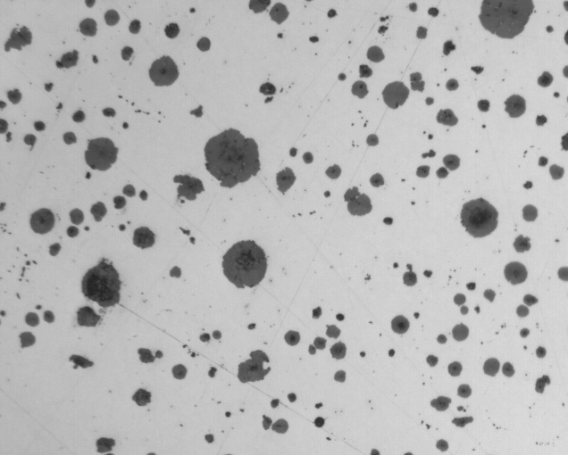
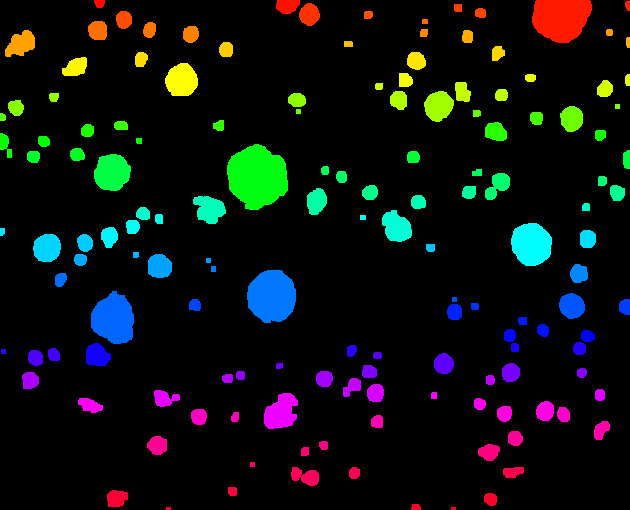
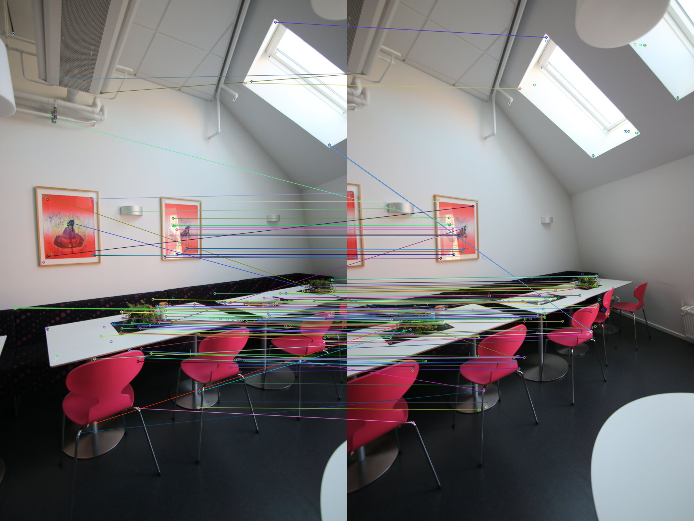
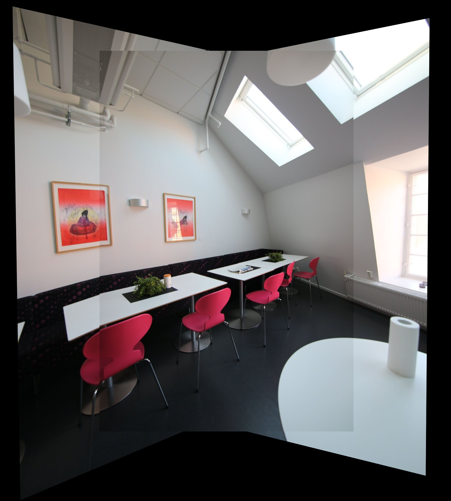

# OpenCV

## Threshold & Connect Component

|Original|Filtered|
|--|--|
|||

## Image Stitching

| Freature Matching| Stitching  |
|--|--|
|||

## Moving Object detect

| Background subtracting   |
|--|
||

| Optical Flow   |
|--|
||

